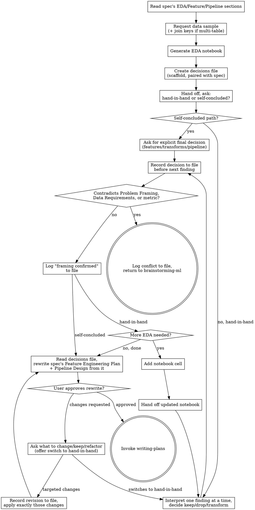

# Running EDA & Finalizing the Feature Pipeline

## Overview

A brainstorming-ml design spec's EDA Plan, Feature Engineering Plan, and Pipeline Design sections are *proposals* — written before anyone has looked at real data. This skill turns the EDA Plan into a runnable notebook, hands it to the user to execute in their own environment, and works through the real results with them one finding at a time to lock in the final feature list and preprocessing pipeline — recording every settled decision to a durable decisions file the moment it's made, so the eventual spec rewrite is drafted from that file, not from a conversation that may run long enough to be summarized or compacted along the way. Only once those decisions are grounded in actual output does the project move on to superpowers:writing-plans.

**REQUIRED BACKGROUND:** You MUST have an approved design spec from superpowers:brainstorming-ml before starting — its EDA Plan, Feature Engineering Plan, and Pipeline Design sections are this skill's input. This skill is the handoff target for brainstorming-ml on ML projects: brainstorming-ml's terminal state is this skill, not writing-plans directly.

**Overrides base brainstorming's terminal rule for ML projects:** superpowers:brainstorming states "the ONLY skill you invoke after brainstorming is writing-plans." For ML projects run through brainstorming-ml, that rule is replaced by this one: brainstorming-ml → running-eda-ml → writing-plans. This skill's own terminal state is writing-plans — invoked only after the process below finalizes the spec's data sections.

<HARD-GATE>
Do NOT decide, guess, or infer what the EDA will show. Every feature/transform/pipeline decision made in this skill must trace back to a result the user actually reported from running the notebook — never to what you'd expect the data to look like. Do NOT write any training, model, or pipeline-implementation code during this skill — the only code you write here is the EDA notebook itself. Do NOT invoke writing-plans until the spec's Feature Engineering Plan and Pipeline Design sections have been rewritten with the finalized, evidence-based decisions and the user has approved the rewrite.

Do NOT leave a settled decision unwritten. The moment a framing check, feature/transform, or pipeline decision is settled with the user, append it to the decisions file before moving to the next finding — not batched, not deferred to Finalize, not reconstructed from memory later. Do NOT draft the Finalize rewrite from conversation memory — re-read the decisions file first and rewrite from what it says. The file is the record; the conversation is not.
</HARD-GATE>

## Anti-Pattern: "I Can Already Guess What the EDA Will Show"

You've seen a lot of tabular churn data — you can probably predict that tenure will matter and a couple of features will be collinear. Guessing right doesn't make it real: the whole point of this skill is that the decision is made from what the user actually saw, not from your prior. If you catch yourself proposing a feature/transform decision before the user has reported a result for it, stop and ask for the result first.

## Process

**1. Read the spec.** Pull the EDA Plan, Feature Engineering Plan, and Pipeline Design sections — the EDA Plan is what the notebook implements; the other two are the *provisional* answer you're about to replace with a grounded one.

**2. Request a data sample.** Before writing a single cell, ask the user for a small sample of the real dataset — a couple of rows plus the column headers, or just the headers if that's all they have handy or are comfortable sharing. You need the actual column names (and ideally dtypes) so the notebook loads and references real fields instead of guessing at names from the spec's prose (the spec says "login frequency"; the column might be `logins_30d`). Also confirm where/how the data is loaded (file path and format, or a query) so the notebook's load cell is runnable as-is.

**If the sample spans more than one file/table:** they're related, not independent — ask the user for the relationship between them (which column is the primary key on one side and the foreign key on the other, and the join cardinality: one-to-one, one-to-many, many-to-many). Use that to write an explicit join cell that produces the single analysis-grain dataset the rest of the notebook's EDA cells run against — don't leave the tables un-joined and don't guess a join key from matching column names. Don't generate the rest of the notebook until the join is confirmed and correct.

**3. Generate the notebook.** If multiple tables were involved, the first cells load each one and join them per the confirmed keys/cardinality into the single dataset the rest of the notebook works from — labeled clearly enough that the user can sanity-check the resulting row count against what they expect. After that, one cell per EDA Plan item, in the spec's order, each labeled with what it's checking and printing/plotting its result clearly (a stray unlabeled `df.corr()` is useless to someone reporting back over chat). Default to a `.ipynb` notebook — that's the format for running EDA interactively against real data. If the user would rather diff it cleanly in git, offer a plain `.py` script with `# %%` cell markers (Jupyter-compatible in VS Code/PyCharm/Jupytext) as the alternative, not the default. Always save it under `EDA/` at the project root — this skill's output always lives there. Write no training, model-fitting, or pipeline code here — only the EDA checks from the spec.

**4. Create the decisions file.** Before handing anything off, create the EDA decisions file at `docs/superpowers/specs/<spec's date-topic stem>-eda-decisions.md` — same folder as the design spec, same date-topic prefix, so the two sort and pair together (spec `docs/superpowers/specs/2026-08-13-churn-prediction-design.md` → decisions file `docs/superpowers/specs/2026-08-13-churn-prediction-eda-decisions.md`). Seed it with a short header (spec path, date) and three empty sections that mirror the spec sections they'll eventually rewrite: **Framing Checks**, **Feature & Transform Decisions**, **Pipeline Decisions**. This file exists independently of the conversation — steps 5, 6, and the framing check append to it as decisions land, and step 8 (Finalize) reads it back instead of relying on conversational memory that may be summarized or compacted by the time the EDA loop finishes.

**5. Hand off — its own message, not bundled with anything else. Always ask which way they want to work through the results:**
> "I've generated the EDA notebook at `<path>`. Run it in your environment. Would you like to go through the results together, one finding at a time — or would you rather analyze it yourself and hand me your final feature and pipeline decisions directly? Either works, just let me know which."

**If hand-in-hand:** continue to step 6.

**If self-concluded:** when they come back, always ask them to state the final decision explicitly — exact features kept/dropped, exact transforms, exact pipeline steps — don't accept a vague summary ("looks fine, use your judgment") as the decision. The HARD-GATE still applies: the decision must be the user's stated conclusion, not something you infer to fill a gap they left vague. Once you have their explicit decision, write it to the decisions file as one consolidated entry (split across Feature & Transform / Pipeline Decisions sections if it spans both) — self-conclusion skips the finding-by-finding loop, not the file. Then skip step 6's interpret-one-finding-at-a-time loop, but still run the framing check below against their stated decision before moving to step 8 (Finalize) — a self-concluded user can report a broken framing just as easily as a hand-in-hand one (e.g. "turns out only 0.2% of rows churned").

**6. Interpret one finding at a time (hand-in-hand path).** For each result the user reports: discuss what it means, decide together whether the feature(s) involved get kept, dropped, or transformed (and how). The moment that decision is settled, append it to the decisions file's Feature & Transform Decisions (or Pipeline Decisions, for a pipeline-step call) section — before asking about the next finding, not after the loop ends. Don't ask about the next EDA item until the current one is resolved and recorded — same discipline as brainstorming's "one question at a time." If a finding surfaces a question the notebook doesn't answer yet (e.g. a correlation that needs a follow-up plot), add the cell, hand off the updated notebook, and go back to interpreting findings one at a time — the mode was already decided at step 5, so this hand-off doesn't re-ask it.

**Check for a broken framing, not just a feature decision — on either path.** Some findings don't just settle a feature's fate — they contradict something brainstorming-ml already established: class balance far more extreme than assumed (invalidates the metric), data turns out time-indexed when the spec assumed i.i.d. (invalidates the split strategy and possibly the problem framing), the label is unusable or missing at the assumed rate. Run this check against every reported result or decision, whether it came from the hand-in-hand loop one finding at a time or from a self-concluded user's final decision in one batch, and log the outcome to the Framing Checks section either way — a conflict (what broke, and the handoff note) or an explicit "framing confirmed, no conflict" line. A confirmed check is still a decision worth a record: it's evidence the check ran, not just evidence something broke. If anything contradicts the spec's Problem Framing, Data Requirements, or chosen metric, stop here — don't patch around it in Feature Engineering Plan or Pipeline Design, and don't widen this skill's scope to cover it either; a broken metric or model-family assumption goes back to brainstorming-ml to fix at the source, same as a broken split strategy. Tell the user what broke and why, and hand back to superpowers:brainstorming-ml to revise those sections before resuming this skill.

**7. Anchor on the goal, not just the statistics.** When the user is unsure whether a finding matters, tie it back to the spec's stated business goal and chosen metric (Overview / Modeling & Evaluation Plan sections) — that's the standard for whether a decision matters, not statistical significance in isolation.

**8. Finalize.** Once every EDA Plan item has a reported result and a decision, **re-read the decisions file in full** — it's the authoritative record of what was actually settled, not your recollection of the conversation, which may already be compacted or summarized by this point. Rewrite the spec's Feature Engineering Plan and Pipeline Design sections in place from what the file says (exact features kept/dropped, exact transforms, exact pipeline steps) — replacing the provisional text, not appending to it. If your own memory of the conversation disagrees with what the file recorded, the file wins. End each rewritten section with a one-line pointer back to the decisions file (e.g. `*Finalized from EDA — see docs/superpowers/specs/2026-08-13-churn-prediction-eda-decisions.md for the full decision trail.*`), so the rationale is discoverable from the spec alone, without the conversation, once this handoff message has scrolled out of view. Then:
> "Spec's Feature Engineering Plan and Pipeline Design sections at `<path>` are updated with the finalized, EDA-backed decisions (full trail in `<decisions file path>`). Please review before we move to the implementation plan."

Wait for approval. **If changes are requested, do not automatically fall back into step 6's interpret-one-finding-at-a-time loop** — that reopens EDA interpretation from scratch, and if the user took the self-concluded path, nothing there was ever discussed finding-by-finding in the first place. Instead, ask the user specifically what they want changed, kept, or refactored in the rewritten sections, and also offer the option to abandon self-conclusion and go through the EDA hand-in-hand instead, if they're not comfortable with how the sections turned out:
> "What would you like changed, kept, or refactored in these sections? Or, if you'd rather, we can go through the EDA findings together instead, one at a time."

If they name specific changes, record the change as a dated addendum in the decisions file, apply exactly those changes to the spec, and re-ask for approval. If they'd rather switch, go to step 6 and work through the findings hand-in-hand from there. Once approved, commit the updated spec **and the decisions file** to git — same as brainstorming's design-doc commit step. Unlike the notebook (commit only if the user wants it kept), the decisions file is never optional: it's the permanent record of why the spec ended up the way it did.

**9. Terminal handoff.** Once approved, invoke superpowers:writing-plans. Do not invoke any other skill — writing-plans now has a finalized feature list and pipeline to build against instead of a proposal.

## Common Mistakes

| Mistake | Why it bites |
|---|---|
| Deciding a feature's fate before the user reported a real result for it | You're pattern-matching against expectation, not evidence — the exact thing this skill exists to prevent |
| Writing model/training/pipeline-implementation code during this phase | This phase produces only the EDA notebook and the finalized spec sections; implementation belongs to writing-plans/executing-plans |
| One giant cell running the whole EDA plan | The user can't isolate a single result to report back; one labeled cell per EDA Plan item keeps the handoff usable |
| Batching multiple interpretation questions into one message | Same failure as skipping "one question at a time" in brainstorming — a wall of questions gets a shallow, rushed answer |
| Treating the handoff as a single round-trip | Findings often raise new questions that need another notebook cell — expect to loop back through steps 5–6, not finish in one pass |
| Deferring the decisions-file write until later in the loop, or until Finalize | Defeats the purpose of the file — if the conversation compacts mid-EDA, there's nothing on disk to recover the lost decisions from |
| Drafting the Finalize rewrite from conversation memory instead of re-reading the decisions file first | Conversation memory may already be compacted/summarized by the time Finalize runs; the file is the only guaranteed-complete record of what was settled |
| Treating the decisions file as optional or scratch, like the notebook | It's the permanent record of why the spec ended up the way it did — always commit it, regardless of whether the notebook itself is kept |
| Rewriting Feature Engineering Plan / Pipeline Design at Finalize without a pointer back to the decisions file | Without the pointer, the rationale is only discoverable from the chat handoff message — once that scrolls out of view, a later reader of the spec has no way to find why a decision was made |
| Skipping the "framing confirmed" log entry because nothing broke | A confirmed check is still a decision worth a record — it shows the check ran, not just that something eventually failed it |
| Invoking writing-plans before the spec sections are actually rewritten | writing-plans needs the finalized decisions as input; handing it the original proposal defeats the point of running the EDA at all |
| Generating the notebook from the spec's prose alone, without asking for a real data sample first | Column names/types guessed from prose rarely match the actual schema — the user has to hand-fix the notebook before they can even run it |
| Guessing a join key from matching column names, or leaving multiple tables un-joined | A wrong or missing join silently changes the row grain (duplicates or drops rows) — every EDA result downstream is computed on the wrong dataset |
| Accepting a vague self-concluded answer ("use your judgment," "looks fine") as the final decision | Violates the HARD-GATE — the self-concluded path still requires the user's explicit stated decision, not your inference filling the gap |
| Not asking which path (hand-in-hand vs. self-concluded) at hand-off, and defaulting to one | The user may want either — always ask instead of assuming |
| On a rejected rewrite, automatically restarting step 6's interpret-one-finding-at-a-time loop instead of asking what to change | For a self-concluded user this drags them into a mode they never opted into; ask what to change first, and offer switching to hand-in-hand as a choice, not a default |
| Patching Feature Engineering Plan or Pipeline Design around a finding that actually breaks Problem Framing, Data Requirements, or the metric | Papers over a broken assumption instead of fixing it at the source — go back to brainstorming-ml for those sections |
| Letting a model-choice-relevant finding get resolved inside this skill (e.g. editing Modeling & Evaluation Plan directly) instead of routing it back to brainstorming-ml | This skill's authority stops at Feature Engineering Plan and Pipeline Design; a finding that bears on model family or metric is a framing break, not a note to log and move past |
| Skipping the framing-contradiction check because the user self-concluded instead of going hand-in-hand | The check isn't mode-specific — a self-concluded user can just as easily report a finding that breaks the metric or split strategy, and skipping step 6 skips the discussion, not the check |
| Falling through to writing-plans directly from brainstorming-ml, skipping this skill | Base brainstorming's terminal rule doesn't apply to ML projects — brainstorming-ml's terminal state is this skill, not writing-plans |
